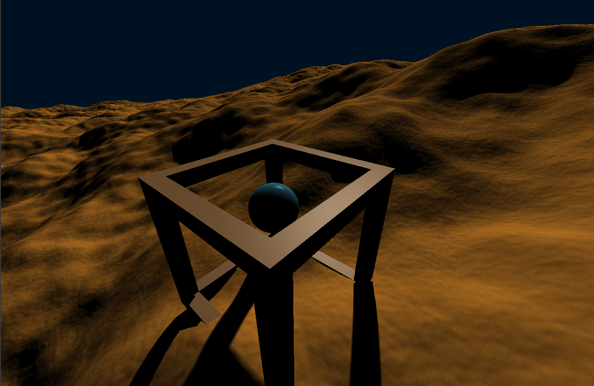

# Ray marching shader



## Overview
A program rendering a single rect (two triangles). Everything else is a fragment shader raymarching the defined signed distance function. Written in C++ with SDL2 OpenGL and glm.

## Installation
```
git clone https://github.com/LennardMarx/RayMarchingShaderCanvas.git
cd RayMarchingShaderCanvas
chmod +x build.sh
./build.sh
```
Run with:
```
./bin/prog
```
Alternatively with prime-run (nvidia graphics):
```
./run.sh
```
The branches include different fragment shaders displaying different signed distance functions.

#### glad (https://glad.dav1d.de/)
OpenGL version 4.1 - all features (core profile)\

#### glm
```
git clone https://github.com/g-truc/glm.git
```
